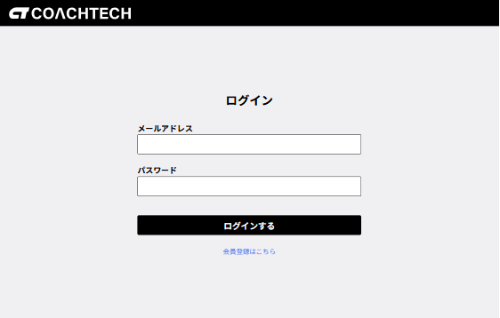
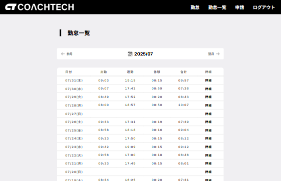
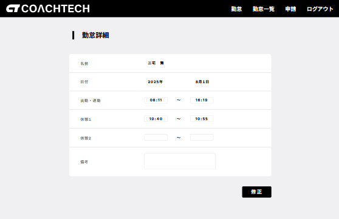
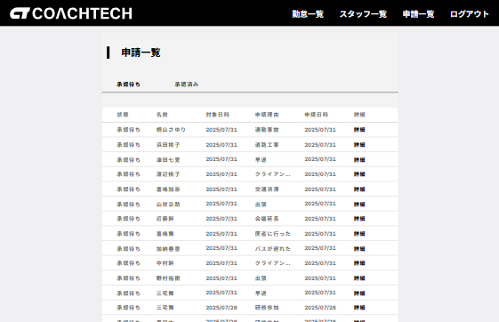
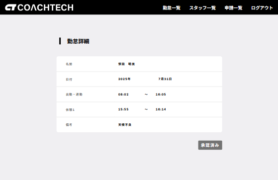

<p align="center">
              
</p>

### サービス概要

企業が開発した独自の勤怠管理アプリです。ユーザーの勤怠管理と管理者による勤怠監視を目的としています。

### 制作の背景と目的

- ユーザーの勤怠管理を効率化
- 管理者による勤怠監視の簡素化
- シンプルで使いやすい勤怠管理システムの提供

### 制作の目標

- 初年度でのユーザー数 1000 人達成

### 主な機能一覧

### 認証機能

- ユーザー登録・ログイン
- メール認証（一般ユーザーのみ）
- ロールベースアクセス制御（ユーザー・管理者）
- Laravel Fortify による認証システム

### ユーザー機能

- 勤怠打刻（出勤・退勤・休憩開始・休憩終了）
- 勤怠一覧表示
- 勤怠詳細表示・修正申請
- 修正申請一覧表示

#### ユーザー画面

- ユーザー登録

<p align="center">
    
</p>

- ログイン

<p align="center">
    
</p>

- 勤怠打刻画面

<p align="center">
    
</p>
<p align="center">
    
</p>
<p align="center">
    
</p>
<p align="center">
    
</p>

- 勤怠一覧画面

<p align="center">
    
</p>

- 勤怠詳細画面

<p align="center">
    
</p>

- 修正申請一覧画面

<p align="center">
    
</p>

### 管理者機能

- 全ユーザーの勤怠一覧表示
- スタッフ一覧表示
- スタッフ別勤怠一覧表示
- 勤怠詳細表示・直接修正
- 修正申請一覧表示
- 修正申請の承認
- CSV 出力機能

### 管理者画面

- ログイン <br>

<p align="center">
    
</p>

- 勤怠一覧画面 <br>

<p align="center">
    
</p>

- スタッフ一覧画面 <br>

<p align="center">
    
</p>

- スタッフ別勤怠一覧画面 <br>

<p align="center">
    
</p>

- 勤怠詳細・修正画面 <br>

<p align="center">
    
</p>

- 修正申請一覧画面 <br>

<p align="center">
    
</p>

- 修正申請の承認画面 <br>

<p align="center">
    
</p>
<p align="center">
    
</p>


### 開発言語・フレームワーク

- **開発言語**: PHP
- **フレームワーク**: Laravel 8.x
- **データベース**: MySQL
- **バージョン管理**: GitHub
- **コンテナ化技術**: Docker

### 開発プロセス

- 設計 → コーディング → テスト

### ER 図


### 環境構築

- **PHP**: 7.4.9
- **MySQL**: 10.3.39-MariaDB
- **Composer**: 2.8.4
- **Docker**: 28.3.0
- **Laravel Framework**: 8.83.29

- ＊ご使用の PC に合わせて各種必要なファイル(.env や docker-compose.yml 等)は作成、編集してください。

### セットアップ手順

####クローン作製手順

1. Github リポジトリのクローン

```bash
git clone https://github.com/ponponmama/attendance-erika-hara.git
```

```bash
cd attendance-erika-hara
```

2. 必要なパッケージのインストール

```bash
sudo apt-get update
```

Docker コンテナのビルドと起動

```bash
docker-compose up -d --build
```

3. Composer を使用した依存関係のインストール

- github からクローンを作成するといくつかのフォルダが足りません。src に setup.sh を作成してあります。プロジェクトはフレームワーク内にインストールするので、先にフォルダ作成お願いします。

- 3-1. コンテナに入ります。

```bash
docker-compose exec php bash
```

- 3-2. スクリプトに実行権限を付与します。

```bash
chmod +x setup.sh
```

```bash
./setup.sh
```

- 以下のフォルダが作成されます

```
      bootstrap/cache \
      storage \
      storage/framework/cache \
      storage/framework/cache/data \
      storage/framework/sessions \
      storage/framework/testing \
      storage/framework/views \
      storage/logs \
      storage/logs/app \
      storage/logs/app/public \
```

<br>

#### "ディレクトリが正常に作成されました。" ← このメッセージが出ます。<br>

<br>

- 3-3 Docker 環境で PHP コンテナに入り、依存関係をインストールします。<br>

```bash
docker-compose exec php bash
```

```bash
composer install
```

<br>

4. 環境設定ファイルの設定

- .env.example ファイルを .env としてコピーし、必要に応じてデータベースなどの設定を行います。

```bash
cp .env.example .env
```

- 環境設定を更新した後、設定キャッシュをクリアするために以下のコマンドを実行します。これにより、新しい設定がアプリケーションに反映されます。

```bash
docker-compose exec php bash
```

```bash
php artisan config:clear
```

この手順は、特に環境変数が更新された後や、`.env` ファイルに重要な変更を加えた場合に重要です。設定キャッシュをクリアすることで、古い設定が引き続き使用されることを防ぎます。

5.アプリケーションキーの生成

```bash
php artisan key:generate
```

6. データベースのセットアップ

#### データベースのマイグレーション

```bash
php artisan migrate
```

7. データベースシーダーの実行

```bash
php artisan db:seed
```

＊マイグレーションとシーダーを同時に実行する場合

```bash
php artisan migrate --seed
```

## 使用方法

### ユーザーとして使用

1. ユーザー登録
2. メール認証
3. 勤怠打刻
4. 勤怠確認・修正申請

### 管理者として使用

1. 管理者アカウントでログイン
2. 勤怠一覧・スタッフ管理
3. 修正申請の承認
4. 勤怠データの直接修正

## テスト

### テスト実行

```bash
docker-compose exec php bash
```

```bash
php artisan test
```

### テスト項目（70 項目）

- **機能テスト**

  - `AdminUserTest.php` - 管理者ユーザー機能テスト
  - `EmailVerificationTest.php` - メール認証機能テスト
  - `AttendancePageTest.php` - 勤怠ページ機能テスト
  - `AdminCorrectionRequestTest.php` - 管理者修正申請機能テスト
  - `AdminAttendanceDetailTest.php` - 管理者勤怠詳細機能テスト
  - `AttendanceListTest.php` - 勤怠一覧機能テスト
  - `AdminAttendanceListTest.php` - 管理者勤怠一覧機能テスト
  - `AttendanceDetailTest.php` - 勤怠詳細機能テスト
  - `AttendanceDetailCorrectionTest.php` - 勤怠詳細修正機能テスト（一般ユーザー）
  - `Auth/LoginTest.php` - ログイン認証機能テスト（一般ユーザー）
  - `Auth/RegisterTest.php` - ユーザー登録機能テスト
  - `Auth/AdminLoginTest.php` - ログイン認証機能テスト（管理者）

  *テストで一旦 db がリセットされます。マイグレートリフレッシュとシーダーしてください。

```bash
php artisan migrate:fresh --seed
```

### メール設定

プロジェクトでは開発環境でのメール送信のテストに Mailtrap を使用しています。


**1.アカウント作成\***
`https://mailtrap.io/` のサイトからサインアップタブをクリックし、アカウント作成します。


**2. Start testing のクリック**
赤枠の部分の Start testing をクリックします。もしくは、左サイドバーで「Email Testing」＞「Inboxes」をクリックします。


**3. Inbox 画面への移動**
Inbox 画面に移動したら、Integrations のセレクトボックスをクリックしてください。


**4. フレームワークの選択**
使用しているフレームワーク等を選びます。Laravel8 を使っていたので Laravel 8.x を選びました。


**5. Laravel の設定**
laravel 8.x を選択したら、Laravel8 の設定をクリックします。


**6. .env 設定のコピー**
Laravel を選択した場合は以下のように.env に貼り付ける用のコードが出ますので、コピーします。


**7. .env ファイルへの設定追加**

下の設定を `.env` ファイルに追加してください。これにより、開発中のメール送信を安全にテストすることができます。

- `MAIL_MAILER`: メールドライバー（例: smtp, sendmail）
- `MAIL_HOST`: メールサーバーのホスト名
- `MAIL_PORT`: メールサーバーのポート番号
- `MAIL_USERNAME`: メールサーバーのユーザー名
- `MAIL_PASSWORD`: メールサーバーのパスワード
- `MAIL_ENCRYPTION`: メール送信の暗号化方式（例: tls, ssl）
- `MAIL_FROM_NAME`: メール送信時の差出人名（環境変数 `APP_NAME` を使用する場合もあり）

```plaintext
MAIL_MAILER=smtp
MAIL_HOST=sandbox.smtp.mailtrap.io
MAIL_PORT=2525
MAIL_USERNAME=your_mailtrap_username # Mailtrapのユーザー名をここに入力
MAIL_PASSWORD=your_mailtrap_password # Mailtrapのパスワードをここに入力
MAIL_ENCRYPTION=tls
MAIL_FROM_NAME="${APP_NAME}" # アプリケーション名を使用する場合
MAIL_LOG_CHANNEL=stack
```

この設定を適用後、アプリケーションからのメールは Mailtrap の仮想 SMTP サーバーを通じて送信され、実際には配信されずに Mailtrap のダッシュボードで確認することができます。

### URL

- **開発環境:** [http://localhost/](http://localhost/)
- **phpMyAdmin:** [http://localhost:8080/](http://localhost:8080/)
